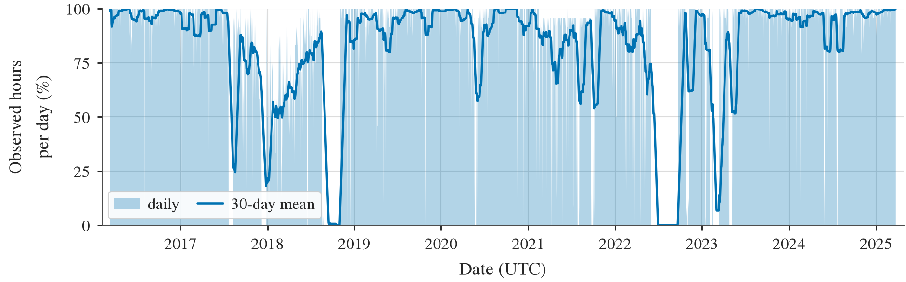
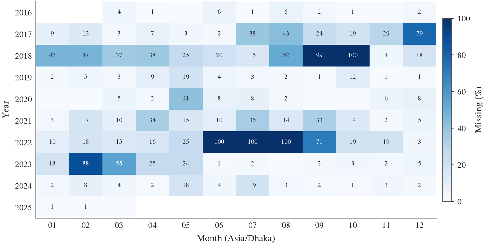
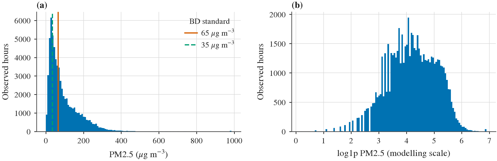
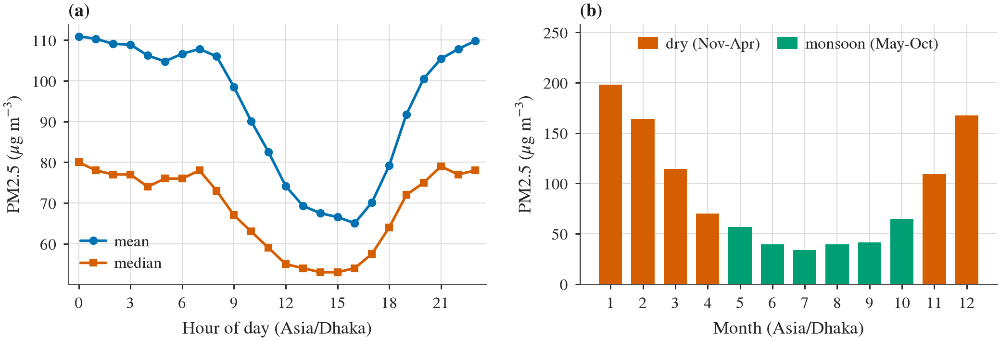

# Data Audit

**Site:** Beijing Wanliu (UCI Multi-Site, id 501)  
**OpenAQ location IDs:** [2445, 8415]  
**Generated by:** `scripts/03_data_audit.py`  
**Local timezone for calendar features:** `Asia/Shanghai`  

> This is the gate before modelling. Every number here is computed from the
> fetched data, not transcribed.

## 1. Verdict

- Usable observed PM2.5: **3.96 years** (34,682 hours)
- Threshold for proceeding as planned: **2.0 years**
- **Gate: PASS**

Dhaka has sufficient contiguous coverage to serve as the primary dataset.
Beijing (UCI) is retained for the cross-city generalisation check.

## 2. Date coverage

| Quantity | Value |
|---|---|
| First observation (UTC) | 2013-02-28 16:00:00+00:00 |
| Last observation (UTC) | 2017-02-28 15:00:00+00:00 |
| Span | 1,461.0 days (4.00 years) |
| Hours in span | 35,064 |
| Hours observed | 34,682 |
| Coverage | **98.9%** |
| Hourly grid complete | True |

## 3. Contiguity and gaps

| Quantity | Value |
|---|---|
| Number of distinct gaps | 180 |
| Longest gap | **23 hours** (1.0 days) |
| Longest gap start (UTC) | 2015-04-20 03:00:00+00:00 |
| Longest gap end (UTC) | 2015-04-21 01:00:00+00:00 |
| Longest unbroken observed run | **1,263 hours** (52.6 days) |
| Longest run start (UTC) | 2013-02-28 16:00:00+00:00 |
| Longest run end (UTC) | 2013-04-22 06:00:00+00:00 |

Gaps matter twice over: they bound how long an input window can be, and
any window spanning one is fabricated data. Gap-aware windowing rejects
those windows and reports the count.

### Gap length distribution

| gap_length   |   n_gaps |   hours_lost |
|:-------------|---------:|-------------:|
| 1 h          |      111 |          111 |
| 2-3 h        |       49 |          105 |
| 4-24 h       |       20 |          166 |
| 1-7 d        |        0 |            0 |
| > 7 d        |        0 |            0 |

The gap count alone is misleading. Most outages are single hours; only
0 exceed a week.
Applying the configured backward-looking forward-fill limit of
3 hours raises coverage from 98.9% to
99.7% and collapses 180 fragments into
21 usable stretches, lengthening the longest from
1,263 h to 7,942 h.

### Ten longest gaps

|   rank |   hours |   days | start_utc   | end_utc    |
|-------:|--------:|-------:|:------------|:-----------|
|      1 |      23 |    1.0 | 2015-04-20  | 2015-04-21 |
|      2 |      17 |    0.7 | 2015-07-12  | 2015-07-13 |
|      3 |      15 |    0.6 | 2016-09-06  | 2016-09-07 |
|      4 |      13 |    0.5 | 2014-10-19  | 2014-10-20 |
|      5 |      11 |    0.5 | 2014-11-03  | 2014-11-04 |
|      6 |      11 |    0.5 | 2015-10-18  | 2015-10-19 |
|      7 |       9 |    0.4 | 2015-04-17  | 2015-04-17 |
|      8 |       8 |    0.3 | 2014-02-25  | 2014-02-25 |
|      9 |       7 |    0.3 | 2015-09-19  | 2015-09-19 |
|     10 |       6 |    0.2 | 2014-12-18  | 2014-12-18 |

The 2022 outage removes an entire monsoon season. Season-stratified
results should be read with that in mind: the wet-season sample is drawn
from eight monsoons, not nine.

### Projected gap-free window yield

What the gaps actually cost, per configuration. This is the number that
decides whether a 168-hour input window is affordable, and it is computed
here rather than discovered during training.

|           |   slots_in_span |   gap_free_windows |   pct_retained |
|:----------|----------------:|-------------------:|---------------:|
| (24, 1)   |         35040.0 |            34490.0 |           98.4 |
| (24, 3)   |         35038.0 |            34452.0 |           98.3 |
| (24, 6)   |         35035.0 |            34395.0 |           98.2 |
| (24, 12)  |         35029.0 |            34281.0 |           97.9 |
| (24, 24)  |         35017.0 |            34053.0 |           97.2 |
| (48, 1)   |         35016.0 |            34034.0 |           97.2 |
| (48, 3)   |         35014.0 |            33996.0 |           97.1 |
| (48, 6)   |         35011.0 |            33939.0 |           96.9 |
| (48, 12)  |         35005.0 |            33825.0 |           96.6 |
| (48, 24)  |         34993.0 |            33600.0 |           96.0 |
| (168, 1)  |         34896.0 |            31854.0 |           91.3 |
| (168, 3)  |         34894.0 |            31818.0 |           91.2 |
| (168, 6)  |         34891.0 |            31764.0 |           91.0 |
| (168, 12) |         34885.0 |            31656.0 |           90.7 |
| (168, 24) |         34873.0 |            31440.0 |           90.2 |

## 4. Quality-control ledger

Every filter, with the rows it removed. Applied in this order.

| rule                      |   removed |   remaining | note                                          |
|:--------------------------|----------:|------------:|:----------------------------------------------|
| raw records               |         0 |       34682 |                                               |
| negative value            |         0 |       34682 |                                               |
| exact zero (sensor fault) |         0 |       34682 |                                               |
| above sanity cap 1000     |         0 |       34682 |                                               |
| flatline run > 12         |         0 |       34682 | (consecutive identical values = stuck sensor) |

## 5. Missingness per variable

### Target

| variable   |   observed |   missing |   pct_missing |
|:-----------|-----------:|----------:|--------------:|
| pm25       |  34682.000 |   382.000 |         1.089 |

### Meteorology (NASA POWER)

| variable    |   observed |   missing |   pct_missing |
|:------------|-----------:|----------:|--------------:|
| WD10M       |  34941.000 |   123.000 |         0.351 |
| T2MDEW      |  35044.000 |    20.000 |         0.057 |
| T2M         |  35044.000 |    20.000 |         0.057 |
| RH2M        |  35044.000 |    20.000 |         0.057 |
| PS          |  35044.000 |    20.000 |         0.057 |
| PRECTOTCORR |  35044.000 |    20.000 |         0.057 |
| WS10M       |  35050.000 |    14.000 |         0.040 |

Units as reported by the POWER API (quoted verbatim, not assumed):

| Parameter | Units |
|---|---|
| PRECTOTCORR | mm/hour |
| PS | kPa (converted from hPa) |
| RH2M | % (derived from TEMP and DEWP, Magnus) |
| T2M | C |
| T2MDEW | C |
| WD10M | Degrees (converted from 16-point compass) |
| WS10M | m/s |

Two of these differ from what is commonly assumed: `PRECTOTCORR` is
reported in mm/day and `ALLSKY_SFC_SW_DWN` in Wh/m^2. Values are used as
returned and never rescaled on an assumption.

**Time standard.** POWER hourly defaults to Local Solar Time, not UTC.
This pull explicitly requested `time-standard=UTC`
and the response header was verified to match.

## 6. Monthly missingness

|   year |     1 |     2 |     3 |     4 |     5 |     6 |     7 |     8 |     9 |    10 |    11 |    12 |
|-------:|------:|------:|------:|------:|------:|------:|------:|------:|------:|------:|------:|------:|
|   2013 | nan   | nan   |   0.0 |   0.6 |   0.3 |   0.7 |   0.1 |   0.1 |   0.1 |   0.3 |   0.1 |   0.5 |
|   2014 |   1.1 |   3.0 |   0.3 |   0.1 |   0.8 |   0.8 |   0.3 |   0.1 |   0.6 |   2.5 |   2.1 |   1.2 |
|   2015 |   0.5 |   0.5 |   1.3 |   6.1 |   0.4 |   0.8 |   2.8 |   1.5 |   1.9 |   1.9 |   1.4 |   0.9 |
|   2016 |   0.3 |   1.1 |   1.9 |   1.7 |   1.5 |   1.2 |   0.8 |   0.4 |   3.1 |   0.9 |   0.3 |   0.9 |
|   2017 |   0.5 |   2.1 | nan   | nan   | nan   | nan   | nan   | nan   | nan   | nan   | nan   | nan   |

## 7. PM2.5 distribution

| Statistic | Value (µg/m³) |
|---|---|
| n | 34,682 |
| mean | 83.37 |
| std | 81.91 |
| min | 2.0 |
| p01 | 3.0 |
| p05 | 6.0 |
| p25 | 23.0 |
| p50 | 59.0 |
| p75 | 116.0 |
| p90 | 191.0 |
| p95 | 247.0 |
| p99 | 376.0 |
| max | 957.0 |
| skew | 1.922 |
| excess kurtosis | 5.343 |

Exceedance of the Bangladesh national standards (Air Pollution (Control)
Rules 2022):

| Threshold | Hours above |
|---|---|
| 65 µg/m³ | 46.14% |
| 35 µg/m³ | 65.27% |

The distribution is strongly right-skewed, which is why the target is
modelled on a `log1p` scale while all metrics are reported in µg/m³, and
why sMAPE replaces MAPE.

## 8. Diurnal and seasonal structure

### By season

| season        |    count |   mean |   median |   std |    max |
|:--------------|---------:|-------:|---------:|------:|-------:|
| dry           | 23083.00 |  91.32 |    63.00 | 91.55 | 957.00 |
| monsoon (wet) | 11599.00 |  67.56 |    53.00 | 54.82 | 560.00 |

Season boundaries follow the Bangladesh Department of Environment: dry
November-April, wet May-October.

### By month

|   month_local |   count |   mean |   median |    std | season        |
|--------------:|--------:|-------:|---------:|-------:|:--------------|
|             1 |    2958 |  97.80 |    71.00 | 102.39 | dry           |
|             2 |    2667 |  90.03 |    48.00 | 105.65 | dry           |
|             3 |    2950 |  97.12 |    72.00 |  90.59 | dry           |
|             4 |    2819 |  73.88 |    62.00 |  56.93 | dry           |
|             5 |    2954 |  67.01 |    54.00 |  51.84 | dry           |
|             6 |    2854 |  74.31 |    56.00 |  62.91 | monsoon (wet) |
|             7 |    2946 |  75.56 |    62.00 |  53.38 | monsoon (wet) |
|             8 |    2960 |  56.31 |    45.00 |  42.80 | monsoon (wet) |
|             9 |    2839 |  64.23 |    47.00 |  56.41 | monsoon (wet) |
|            10 |    2934 |  94.91 |    59.00 |  93.95 | dry           |
|            11 |    2852 |  98.36 |    75.00 |  90.39 | dry           |
|            12 |    2949 | 110.82 |    76.00 | 113.68 | dry           |

### By hour of day (Asia/Dhaka)

|   hour_local |   count |   mean |   median |   std |
|-------------:|--------:|-------:|---------:|------:|
|            0 | 1454.00 |  92.19 |    67.00 | 86.50 |
|            1 | 1451.00 |  90.80 |    66.00 | 87.07 |
|            2 | 1448.00 |  88.60 |    64.00 | 86.33 |
|            3 | 1446.00 |  85.83 |    63.00 | 81.46 |
|            4 | 1449.00 |  83.82 |    62.00 | 80.63 |
|            5 | 1452.00 |  81.02 |    59.00 | 79.20 |
|            6 | 1454.00 |  79.30 |    59.00 | 78.83 |
|            7 | 1449.00 |  78.63 |    58.00 | 76.01 |
|            8 | 1449.00 |  80.50 |    60.00 | 75.73 |
|            9 | 1452.00 |  81.40 |    59.00 | 76.13 |
|           10 | 1443.00 |  81.82 |    58.00 | 78.36 |
|           11 | 1422.00 |  80.92 |    55.00 | 79.86 |
|           12 | 1437.00 |  78.57 |    53.00 | 79.04 |
|           13 | 1442.00 |  78.30 |    53.00 | 80.17 |
|           14 | 1443.00 |  77.58 |    53.00 | 80.32 |
|           15 | 1432.00 |  76.44 |    50.00 | 79.49 |
|           16 | 1432.00 |  75.73 |    50.00 | 78.44 |
|           17 | 1433.00 |  77.39 |    52.00 | 79.29 |
|           18 | 1442.00 |  80.64 |    55.00 | 81.39 |
|           19 | 1451.00 |  84.95 |    58.00 | 84.62 |
|           20 | 1452.00 |  88.70 |    62.00 | 87.20 |
|           21 | 1450.00 |  91.68 |    64.00 | 88.17 |
|           22 | 1447.00 |  92.64 |    66.00 | 87.59 |
|           23 | 1452.00 |  93.09 |    67.00 | 87.46 |

## 9. Fused dataset (PM2.5 + meteorology)

| Quantity | Value |
|---|---|
| Rows after inner join on UTC hour | 35,064 |
| Rows with no missing value in any column | 34,553 |
| Fully-complete fraction of joined rows | 98.5% |

---

## Decision required

Coverage clears the threshold. Awaiting go-ahead to proceed to Phase 2
(features, splits, leakage tests).
